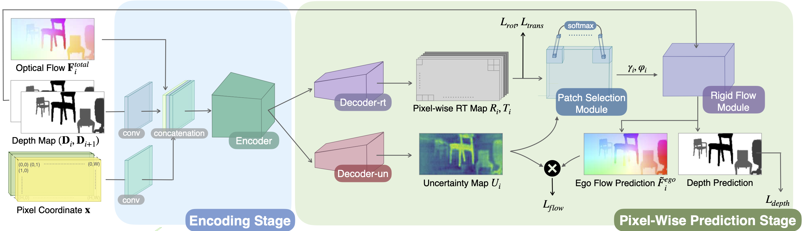

## Pixel-Wise Prediction based Visual Odometry via Uncertainty Estimation (PWVO)

<center>
</img>
</center>

This repository contains the tensorflow-2.0 based implmentation of the paper titled "Pixel-Wise Prediction based Visual Odometry via Uncertainty Estimation".

PWVO models the camera rotation and translation estimation as a dense prediction problem for each pixel. With the uncertainty estimation, PWVO can identify the noisy regions in the input observations in the pixel 
granularity.

In order to train PWVO in a comprehensive fashion, we further develop a data generation workflow for generating synthetic training data.

### Demonstration

<center>
</img>
</center>

### Dependencies

- Python 3.7
- Tensorflow >= 2.5.0

```shell
pip install -r requirements.txt
```

Install the necessary python packages.

### Generate Training Dataset

- Prepaired object mask, please refer to the [cite](https://github.com/uvavision/chair-segments).
- Generate training dataset
```bash
cd data_generation
python data_generation.py --parallel --mask_path {Mask Directory} --save_path {Save Directory}
```

You can get help for a specific command by specifying `--help` after the command.

The directory tree which generated training dataset saves the data will look like: 

```bash
├── custom_dataset
    ├── 000000.tfrecords
    ├── 000001.tfrecords
    ...
    ...
    ...

    ├── 099999.tfrecords
```

Suggest that, using tensorflow-cpu is faster than tensorflow-gpu with generating training dataset in the file format of `.tfrecords`.

### Required Datasets to Evaluate

- [Sintel](http://sintel.is.tue.mpg.de)
- [TartanAir](https://theairlab.org/tartanair-dataset/)

In Sintel, it does not provide the ground truth ego flow field, therefore, we should use the depth map, camera intrinsic and extrinsic that sintel supports to generate the ego flow field for further evaluation. Compare to the Sintel, TartanAir provide optcial flow field, which is not including object flow fields.

We assume the directory tree look like:
```bash
├── sintel_dataset
    ├── resize_total_motion
        ├── 000000.npy
        ├── 000001.npy
        ...
        ...
        ...
        ├── 001041.npy
    ├── resize_camera_motion
    ├── relative_camera_angle
    ├── relative_camera_translation
    ├── resize_depth_t0
    ├── resize_depth_t1
    ├── resize_camera_intrinsic
```

We assume the camera intrinsics are the same between different timesteps, so in the evaluation stage we pick up the samples that camera intrinsic do not change.

### Evaluation
- Evaluate PWVO on the Sintel dataset.

```bash
python evaluation.py --detail evaluation --weight_path {Weight Directory} --eval_data_path {Evaluation Data Directory} --coord --selection patch_soft_select --eval_dataset sintel --epoch_num 100
```

- We also provide our model mentioned in paper called PWVO [checkpoint](https://www.dropbox.com/scl/fo/b9npo97h4j5mi5nqrharl/h?dl=0&rlkey=hzi3obzzmy8ndqyap2zb1p3yo) for evaluation.
- Evaluation results on the Sintel dataset may look like the following table.

|    Method   | End-Point-Error (EPE) | Rotation Angle Error ($R_{err}$) | Translation Offset Error ($T_{err}$) | 
|:-----------:|:-----------------------------:|:--------------------------------:|:-----------------------------:|
| PWVO |  0.6  | 0.081  | 0.043 | 

### Training
- Train PWVO on our custom dataset.

```bash
python train.py --detail training --data_path {Training Dataset Directory} --eval_data_path {Evaluation Data Directory} --coord --selection patch_soft_select --ego_motion --depth 
```

### References

```
@misc{pintoalva2020chair,
      title={Chair Segments: A Compact Benchmark for the Study of Object Segmentation}, 
      author={Leticia Pinto-Alva and Ian K. Torres and Rosangel Garcia and Ziyan Yang and Vicente Ordonez},
      year={2020},
      eprint={2012.01250},
      archivePrefix={arXiv},
      primaryClass={cs.CV}
}
```
    
```
@inproceedings{Butler:ECCV:2012,
      title = {A naturalistic open source movie for optical flow evaluation},
      author = {Butler, D. J. and Wulff, J. and Stanley, G. B. and Black, M. J.},
      booktitle = {European Conf. on Computer Vision (ECCV)},
      editor = {{A. Fitzgibbon et al. (Eds.)}},
      publisher = {Springer-Verlag},
      series = {Part IV, LNCS 7577},
      month = oct,
      pages = {611--625},
      year = {2012}
}
```

```
@article{tartanair2020iros,
      title =   {TartanAir: A Dataset to Push the Limits of Visual SLAM},
      author =  {Wang, Wenshan and Zhu, Delong and Wang, Xiangwei and Hu, Yaoyu and Qiu, Yuheng and Wang, Chen and Hu, Yafei and Kapoor, Ashish and Scherer, Sebastian},
      booktitle = {2020 IEEE/RSJ International Conference on Intelligent Robots and Systems (IROS)},
      year =    {2020}
}    
```